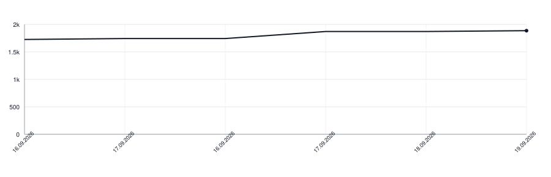

[](https://github.com/apakabarlabs/readaloudkit-swift/actions/workflows/tests.yml)
[](https://apakabarlabs.github.io/readaloudkit-swift/documentation/readaloudkit/)
# readaloudkit-swift

Decides whether a person reading a printed text aloud said what is written, and
holds that decision in one place so that every side of a product answers the
same way.

A recogniser does not return the text that was read. It returns today's spelling
for an old one, a word boundary in the wrong place, and now and then a different
word for the same sound. What counts as having said a word is therefore a rule,
not a comparison, and a rule that lives in two places drifts: the phone clears a
line the server holds, and nobody can say which is right.

## What it decides

- **Whether a word was said.** The recogniser's output is lined up against the
  text, and each pair is the written word itself or a spelling written down for
  the build that misheard it.
- **What a build is allowed to mishear.** `RecognizerQuirks` carries those
  spellings, narrowed where a word is only misheard in one turn of phrase.
- **Where the reader is.** Which line is being read, which words of it are
  already behind, and which word the narration is on.
- **Whether a piece is finished**, and what a stage of a drill still owes.

## Use

```swift
let check = SpokenWords.check(expected: written, heard: transcript, quirks: quirks)
let saidEveryWord = check.faithful.count == check.matches.count
```

## The measure belongs here

A tool that hears our own recordings back before they ship uses this same code,
so that the bar a reader is held to is the bar the recordings are held to. A
recording that would fail a reader is caught before anyone reads it.

## Documentation

The [Swift-DocC API reference](https://apakabarlabs.github.io/readaloudkit-swift/documentation/readaloudkit/)
is generated from the public API on every push to `main`.

## Lines of Code

<picture>
  <source media="(prefers-color-scheme: dark)" srcset=".github/loc-history-dark.svg">
  <source media="(prefers-color-scheme: light)" srcset=".github/loc-history-light.svg">
  
</picture>
